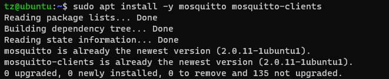
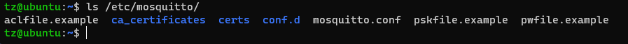
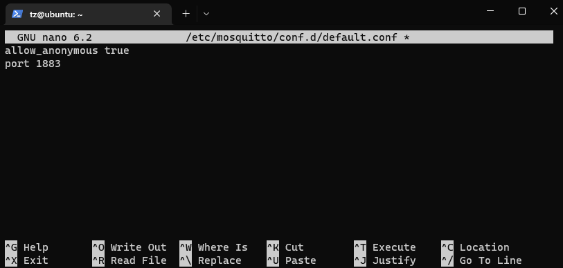
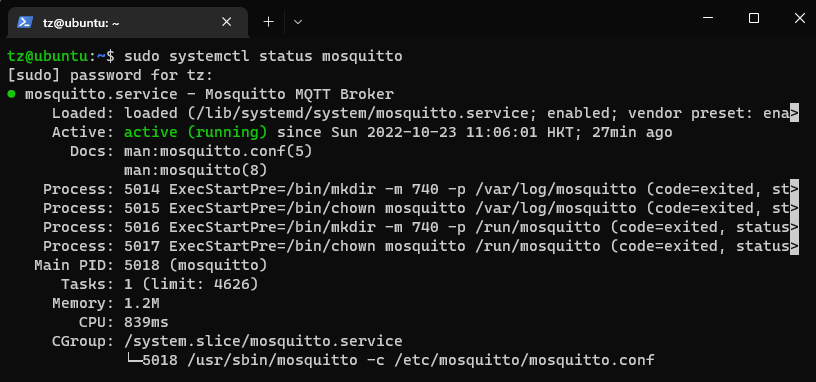
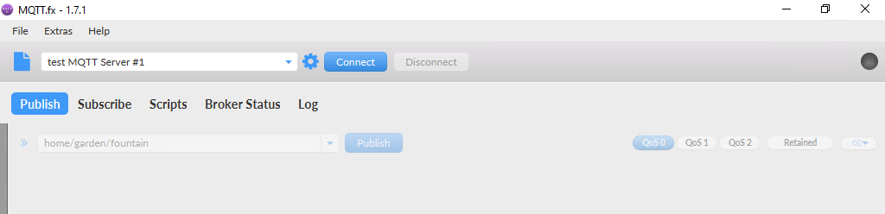
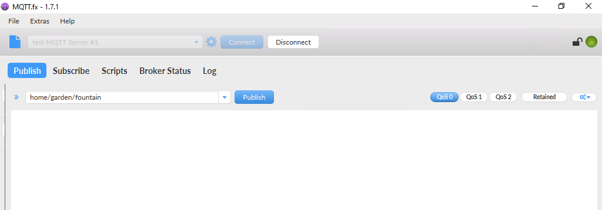
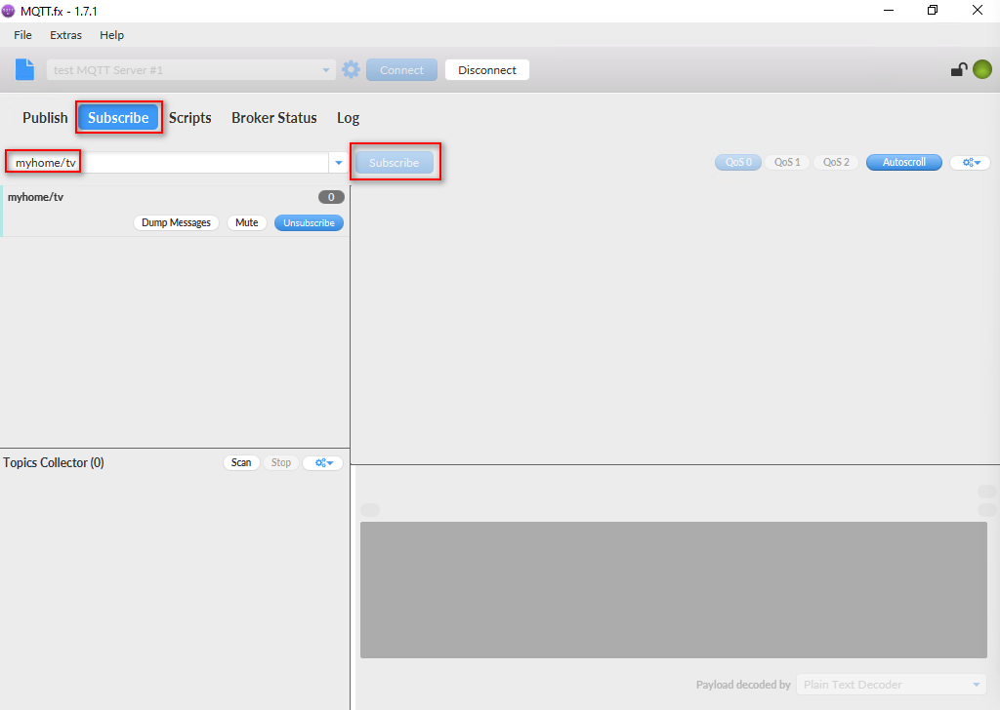
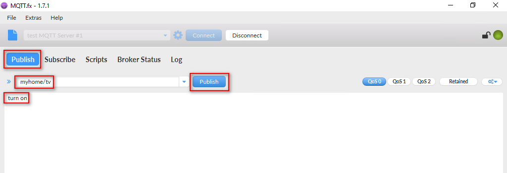
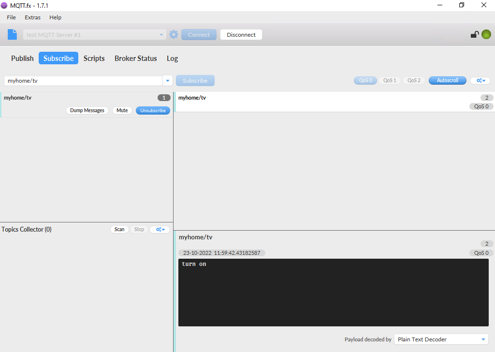
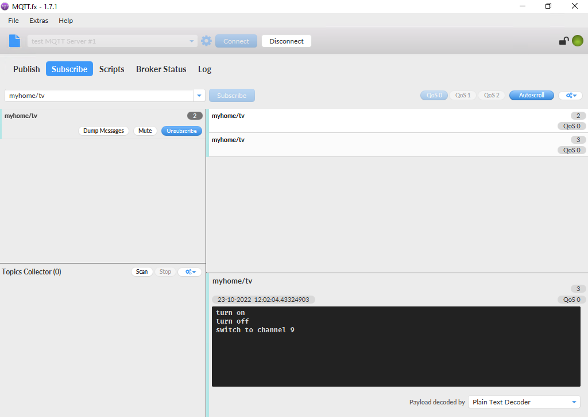

# Lab 1: Set up a MQTT Broker

# Prerequisites:
- Ubuntu `18.04` LTS VM
  - You may use older versions if you want.
  - You may run it on local VM or Cloud VM.
- Windows Development PC
    - AMD64 PC running Windows 10 Pro
- MQTT.fx v1.7.1 for Windows
  - Download from [HERE](software/mqttfx-1.7.1-windows-x64.exe)


# 1. Install Mosquitto

Enable SSH on the Ubuntu if not yet. 
```
sudo apt install -y openssh-server
```

Log into the Ubuntu VM through SSH.

```
ssh tz@ubuntu
```

Once logged in, you may start to start to install Mosquitto.

```
sudo apt udpate
sudo apt install -y mosquitto mosquitto-clients
```



The Mosquitto is installed at `/etc/mosquitto`. You may list the directory to take a look.




# 2. Configure Mosquitto

Create a config file.

```
sudo nano /etc/mosquitto/conf.d/test.conf
```

Add two lines in the file.

```
allow_anonymous true
port 1883
```



Click `Ctrl + X`, then `Save` it.

# 3. Restart the service or restart the system

```
sudo systemctl restart mosquitto
```
Once restarted, verify if the service is running.

```
sudo systemctl status mosquitto
```




# 4. Test with MQTT.fx

## 4.1 Install MQTT.fx

On Windows, install `MQTT.fx v1.7.1` and run it.

## 4.2 Configure MQTT.fx

Create a new profile as below:
- Profie Name: `test MQTT Server #1`. 
- Profile Type: `MQTT Broker`.
- Broker Address: `{IP address of Your Ubuntu}`.
- Broker Port: `1883`.
- Client ID: `{Your client ID}`


Leave others as default and click `Apply` and then `OK`, then `Cancel` to the main UI.


## 4.3 Connect to MQTT Server



Click `Connect` and you will see the connection is established.




## 4.4 Test with some topics

Let's use a home scenario for instance.
- topic: myhome/tv
- command: 
  - turn on
  - turn off
  - switch to channel 9

Go to `Subscribe` -> enter `myhome/tv` -> Click `Subscribe`.



Go to `Publish` -> enter `myhome/tv` in the topic area -> enter `turn on` in the message area -> click `Publish`.




Then go to `Subscribe` and you will see `turn on` is received.



You may publish more messages and see the logs.




`<END OF LAB1>`