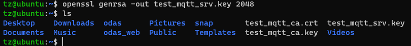

# Lab 2: Set up a MQTT Broker over TLS

You may have noticed that the `lock icon` in Lab 1 is open because this MQTT connection is considered `unsecure`.


In this lab, we are going to set up a MQTT Broker with TLS enabled.


# Prerequisites:
- Lab 1 is comleted.


# 1. Create CA Certificates and Server Certificats

To establish a TLS connection, you need below things on the broker:
- CA certificate
- Server certificate signed by CA with its private key
- Server private key: 


## 1.1 Create CA key pair

On Ubuntu, run below command:

```
openssl genrsa -des3 -out test_mqtt_ca.key 2048
```

You may be prompted to enter `PEM pass phrase`, enter a phrase like: `test1234` twice.


## 1.2 Create CA Certificate

```
openssl req -new -x509 -days 3650 -key test_mqtt_ca.key -out test_mqtt_ca.crt
```
You may be prompted to enter the pass phrase and also the location info. 


## 1.3 Create Server key pair for MQTT Broker 

```
openssl genrsa -out test_mqtt_srv.key 2048
```



## 1.4 Create Certificate Request from CA

```
openssl req -new -out test_mqtt_srv.csr -key test_mqtt_srv.key
```
You may leave all the fields default by pressing `Enter`.


## 1.5 Verify and Sign the Server Certificate using CA Key

Sign the server request through the CA to get the broker certificate:

```
openssl x509 -req -in test_mqtt_srv.csr -CA test_mqtt_ca.crt -CAkey test_mqtt_ca.key -CAcreateserial -out test_mqtt_srv.crt -days 360
```

Enter the pass phrase you created before if prompted.


Verify the signed certificate.

```
openssl verify -CAfile test_mqtt_ca.crt test_mqtt_srv.crt
```


## 1.6 Copy the Certificates and Keys to Mosquitto folders

Now that beow 5 files are created:
- `test_mqtt_ca.crt`: CA Certificate
- `test_mqtt_ca.key`: CA key pair (private, public)
- `test_mqtt_srv.crt`: Server Certificate
- `test_mqtt_srv.csr`: Certificate sign request, not needed anymore
- `test_mqtt_srv.key`: Server key pair 

Among them, three fiels are important and needed.
- `test_mqtt_ca.crt`: CA Certificate
- `test_mqtt_srv.crt`: Server Certificate
- `test_mqtt_srv.key`: Server key pair 
 
Go to `/etc/mosquitto/`, there are two fodlers `ca_certificates` and `certs`. Inside of each folder, there is a `README` file. 


This means we should copy the CA certificates into `/etc/mosquitto/ca_certificates` directory and Server keys and certificates into the `/etc/mosquitto/certs` directory.

```
sudo cp test_mqtt_ca* /etc/mosquitto/ca_certificates/
sudo cp test_mqtt_srv* /etc/mosquitto/certs/
```

Check the files copied.


# 2. Configure Mosquitto

Modify the config file created in Lab 1.

```
sudo nano /etc/mosquitto/conf.d/test.conf
```

Modify as below:

```
# allow_anonymous true
# listener 1883

# Use TLS
listener 8883

# certificates and key
cafile   /etc/mosquitto/ca_certificates/test_mqtt_ca.crt
certfile /etc/mosquitto/certs/test_mqtt_srv.crt
keyfile  /etc/mosquitto/certs/test_mqtt_srv.key

```


Click `Ctrl + X`, then `Save` it.

# 3. Restart the service or restart the system

```
sudo systemctl restart mosquitto
```
Once restarted, verify if the service is running.

```
sudo systemctl status mosquitto
```


# 4. Test with MQTT.fx

## 4.1 Configure MQTT.fx

Create a new profile as below:
- Profie Name: `test MQTT Server #2`. 
- Profile Type: `MQTT Broker`.
- Broker Address: `{IP address of Your Ubuntu}`.
- Broker Port: `8883`.
- Client ID: `{Your client ID}`

Leave others as default and click `Apply` and then `OK`.

Click `SSL/TLS` -> Tick `Enable SSL/TLS` -> CA Certificate file: select your CA File created in step 3: `test_mqtt_ca.crt`.

Then click `Apply` to save it. Click `Cancel` to the main UI.


## 4.2 Connect to MQTT Server

On the main UI, select `test MQTT Server #2`, and then click `Connect` and you will see the connection is established.


Now you may have noticed the `lock icon` is on locked status.


## 4.3 Test with some topics

Let's use a home scenario for instance.
- topic: myhome/tv
- command: 
  - turn on
  - turn off
  - switch to channel ###

Go to `Subscribe` -> enter `myhome/tv` -> Click `Subscribe`.

Go to `Publish` -> enter `myhome/tv` in the topic area -> enter `turn on` in the message area -> click `Publish`.

Then go to `Subscribe` and you will see `turn on` is received.

You may publish more messages and see the logs.


## 4.5 Specify client connection

Open `/etc/mosquitt/conf.d/test.conf`, and add below two lines:

```
# disable anonymous connection
allow_anonymous false

# authentification
password_file /etc/mosquitto/pwfile
```


Create `pwfile`.
```
sudo touch /etc/mosquitto/pwfile
```

Create clientID and password. 

```
sudo mosquitto_passwd -c /etc/mosquitto/pwfile device1
```

Enter password twice. 

Then restart mosquitto service and check the status. Make sure it's up and running.


## 4.6 Check 


`<END OF LAB2>`