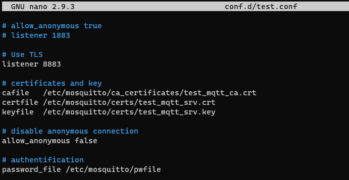
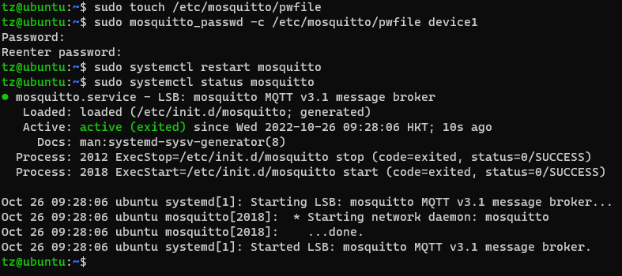

# Lab 3: Confiugre MQTTS Broker with pwfile

In this lab, we will configure the MQTTs Broker to mutual authentification.

# Prerequisites:
- Lab 1, 2 are comleted.


# 1. Modify configuration file

Open `/etc/mosquitt/conf.d/test.conf`, and add below two lines:

```
# disable anonymous connection
allow_anonymous false

# authentification
password_file /etc/mosquitto/pwfile
```



Create `pwfile`.
```
sudo touch /etc/mosquitto/pwfile
```

Create user name `device1` and password. 

```
sudo mosquitto_passwd -c /etc/mosquitto/pwfile device1
```

Enter password twice. In my case, `test1234`.

Then restart mosquitto service and check the status. Make sure it's up and running.




# 2. Configure the MQTT.fx

Open the profile and click `User Credentials` -> Add `User Name` and `Password`. In my case, User name is `device1`.


Click `Apply` and then `Cancel` to the main UI.

# 3. Test the broker

On the main UI, click `Connect` to establish the connection.

Subscribe with a topic and try to publish some test messages. You wll see them on the monitoring window.


`<END OF LAB3>`