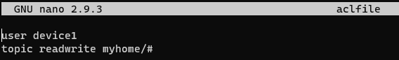
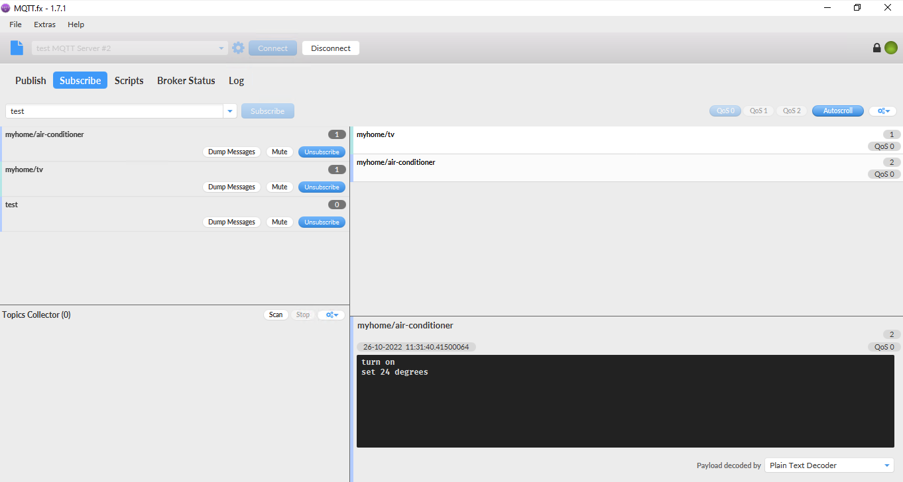
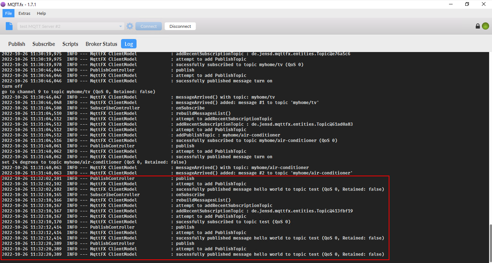

# Lab 3: Confiugre MQTTS Broker with aclfile

In this lab, we will configure the MQTTs Broker to mutual authentification.

# Prerequisites:
- Lab 1, 2, 3 are comleted.


# 1. Modify configuration file

Open `/etc/mosquitt/conf.d/test.conf`, and add below lines:

```
# configure topics
acl_file /etc/mosquitto/aclfile
```


Create `aclfile`.
```
sudo nano /etc/mosquitto/aclfile
```

Add below lines in the :

```
user device1
topic readwrite myhome/#
```



Save and exit.

Then restart mosquitto service and check the status. Make sure it's up and running.


# 2. Configure the MQTT.fx

Open the profile and click `User Credentials` -> Add `User Name` and `Password`. In my case, User name is `device1`.

Enter a new Client ID like `test_client`.

Click `Apply` and then `Cancel` to the main UI.

# 3. Test the broker

On the main UI, click `Connect` to establish the connection.

Subscribe with a topic and try to publish some test messages. You wll see them on the monitoring window.



You probably have noticed that only the suscribed topics like `myhome/tv` and `myhome/air-conditioner` show received messages published. However, the subscribed topic `test` comes with no message.  





`<END OF LAB4>`